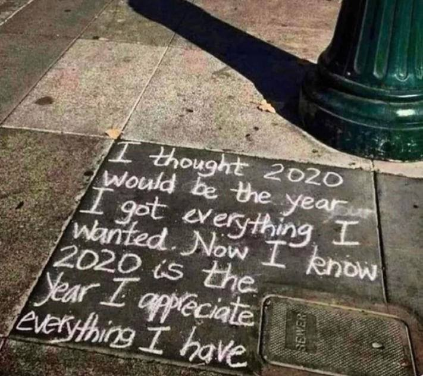

As 2020 draws to a close, I’ve come to a closer appreciation for existence. A friend of mine recently commented “You’ve done more than anyone else I know”, while this should be an ego boost, it made me reflect why I have “done so much”. The Hedonic Treadmill is an observed tendency of humans to return to stable levels of happiness despite major positive or negative events. In essence, it’s what forces us to have a constant drive to success despite our achievements. Watching the Michael Jordan documentary, you can clearly see what he means every time he says “… and I took that personally”, how many rings are enough? Why does he keep working hard even after he’s been crowned the GOAT? How much more can you go than, quite literally, being named the best in your field? Success and happiness are always slightly out of our reach, and while they feel like a ‘state’ to achieve, the truth is that they are fake ideals, quite literally never achievable.

I was going to write an article over the summer praising the effects of the hedonic treadmill, but the reality is that it, while it forces you to keep looking up, it also makes you numb to feelings of happiness, especially ones derived from “achieving” something. Listening to a “The Knowledge Podcast” episode, an interviewee said how we never notice tailwinds but always complain about headwinds. I believe this is a function of the hedonic treadmill because we believe our adversity is what makes it more difficult to achieve something, and we ourselves are special in encountering that adversity. In believing our adversity is special, we self-enforce the idea that the ‘something’ to get is more valuable, and we want It more. As we set up this ‘goal’ to achieve, the hedonic treadmill comes into play. We keep looking at this goal and we then internally shift the goalposts. If we ever get that goal, we instantly shift our sights to something harder, more difficult, and more unachievable. A personal example of this is when I had gotten into Microsoft in November 2019, I was ecstatic for about a week before I felt myself come back down. This is clearly the treadmill playing its role, after achieving something, your happiness reverts to its base state forcing you to look for the next thing. Over the winter break, I told my friends I had the goal of getting a paper published (now being reviewed!), before securing a research position. In February after I secured the position, I started to look at what’s next, settling on applying for the top strategy consulting firms (McKinsey, Bain, BCG) which are notoriously elitist. Looking back on these experiences, I don’t think I would have enjoyed strategy consulting one iota, but the sole fact that only a small percentage of undergrads have papers or are in strategy consulting appeals to my hedonic treadmill mind – always onto the next thing. Without the appreciation to understand what I’d done, how I’d done it, and the real point – If I’d deserved it. The truth is that when anyone asks “how did you do X or Y '' my answer is always unequivocally luck.

This brings me to 2020, and the realization I have a lot to be grateful for. Every time I walk down the street, I realize how grateful I am to be simply here. Walking down the street in a calm, safe manner is a privilege. Even our internal drive to do more is a privilege. Almost all my readers here are reading this on a laptop or smartphone worth more than many people earn an entire year. Living here, today, now is what I realize is a true privilege and I’m grateful for it. This semester I took a course called TEP444, which focused on happiness, but I think it highlighted a lot of existing feelings about gratitude I was feeling. In particularly a recurring theme was gratitude for opportunities that I’ve been given. A fantastic example is applying to Big N companies, these companies (especially FAANG/FAMG) receive tens of thousands of applications each cycle. If you honestly only apply through their portals, there is an infinitely small chance your application will ever be seen by a real recruiter. To get through to these companies is a RNG, and getting an interview is solely luck. To that end, being given my opportunity to get through that process and work at Microsoft was purely luck! That being said, I am incredibly thankful for the opportunity to do so. Even stepping further back, working at Interac was purely luck as well. I walked into that interview having just completed an entire year of chemical engineering with only some assorted python projects under my belt, never having touched good OOP code, yet 3 hours later, with an offer in hand. Spam applying on CLN, by pure chance, lead me to getting my first Software Engineering Job. Working with the Multimedia lab after getting dropped by the aforementioned research position being secured this year was rather lucky (especially considering he didn’t look at my Transcript!). The realization that opportunity may be derived from talent, it only accounts for about 5-10% of the actual reason you were offered that opportunity, and the other 90-95% was pure luck.

In reflecting across a hectic year, I think understanding what has happened to us, and how we got to be wherever we are is really vital. Our appreciation for what has happened can allow us to reflect and perhaps gain a better understanding of what it means to succeed or to fail. In acknowledging our paths to success, think about how the RNG of life has placed you here in a place where you can reflect. Reflecting across our successes and motivations can also give us a clearer indication of what we want, why we want it and how we can get there. Acknowledging the luck I’ve had is obvious for me to come to terms with “how” I’ve done things, and clearly the reason “why” is due to the treadmill. As such, being aware of meta-motivations can allow me to dissect a goal or action I have in the future, allowing me to determine the actual value and establish a more concrete base for success. 

Thank you everyone for reading my blog in 2020. I appreicate every single one of you, and always welcome criticism. I want every one of you to have a great 2021 despite the year we've had. 

Further Watching:

https://www.youtube.com/watch?v=3LopI4YeC4I