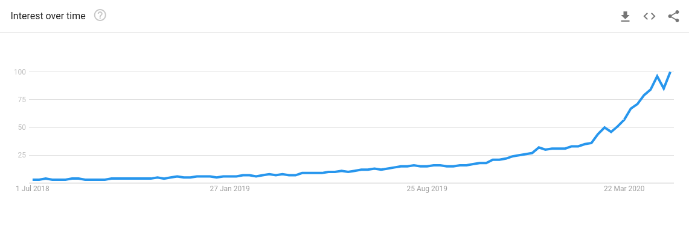

Has there ever been a doubt that we live in the most connected time in human history? With the advent of the internet and the current surge in messaging platforms, the information superhighway is connecting more and more people across the globe! Truly an accomplishment when a 3-month voyage is now reduced to mere milliseconds of connection. 

Then why do we feel so lonely? Think about the deepest relationship you have. Is it a true, fulfilling one? Do you feel complete in your significant emotional relationship? What happens when you feel lonely at 2 am after getting off Twitter? A Tinder binge perhaps? The emotional gaps that we feel today make us feel like we’re abandoned on our own small island with a single palm tree and a smartphone.

The truth remains, that we are extremely lonely. Like our 2 am Tinder binge, we turn to some quick pleasures to feel the ghost of a significant relationship in our lives. Our deep-seated insecurities about our place in the world is being exploited by the current world model where profits reign supreme. We are seeing a rise of technologies whose sole intention is not to connect the world in a deeper way, but to monetize loneliness. 

I had just turned on my headphones and pressed play on episode 407 of the Freakonomics Radio podcast, “Is there a Loneliness Epidemic?”, when my mind began to wander to my own emotional state. How often has it been that I’ve felt like meeting up or calling someone only for my mind to draw a blank with whom I could do so? According to a 2018 survey by the Economist [1] 22% of Adults in the United States say they ALWAYS feel lonely. Perhaps a part of it is due to an over-romanization of loneliness from novels and articles that we read. In Walden, David Thoreau writes “Why should I feel lonely?… I am no more lonely than the loon in the pond that laughs so loud, or than Walden Pond itself.” And so the idea of a lonely life spreads - that we should indeed be alone because it is romantic, the natural way of life. 

Or perhaps the concept of loneliness is tied to the concept of freedom, the ability to do whatever we want because we are truly by ourselves. I remember moving into my apartment for the first time & I showed my parents to the door only to just sit on my bed in contemplation for half-an-hour before going to Campus to see my friends. The feeling of loneliness we experience isn’t a one-off experience. Everyone from your mother to mine feels lonely at times, but the over expression of loneliness is the main culprit of our woes. We see dystopic films of men and women living alone in cramped quarters eating packaged ramen for the 475th day in a row with seemingly no focus on the loneliness they face in their lives. They go to work, have sex, drink and watch TV with so few deep emotional connections that it makes me question that reality. Certainly, without deep emotional connections they would at least contemplate another way of living. 

An example: Quarantine. The first few weeks of quarantine were unexpectedly productive because I had the impression I had work to go back to by the end of the month. All would be well – I was simply taking a break from my friends, and from the new ones I’d be making! It was perfectly okay, I was going to be interacting and having fulfilling relationships once again! No expectations of my internship being pushed to remote, nor the thousands of infected that would come to Ontario. But as I sit here, on my 84th day of quarantine without having interacted face-to-face with anyone other than my parents, I can assure you, I am at my peak of loneliness. I don’t even think I’m alone in feeling this way (pun intended) – Yesterday there was a massive gathering at Trinity-Bellwoods park, because of the beautiful weather and, of course, people’s desire to interact with their friends once more. 

With the advent of loneliness in our society, not only caused by quarantine but as a whole, there’s been a surge in technologies to fill the loneliness chasm. We use Tinder to find matches, with the hope of sex or the idea of love. We use Skype for business calls, Zoom to chat with our friends. This surge in technologies whose mission statements reads like a poem about finding the connection between people, actually have a different goal of maintaining profits no matter the cost. Even if that cost is encouraging separation & loneliness itself. A new NSFW site has been the rise since 2019, called OnlyFans. Onlyfans is a private NSFW content platform, where anyone can post their NSFW pictures locked behind a subscription paywall. In turn, users pay a subscription to view & chat with OnlyFans content-creators which ends up being a lucrative business. With a majority female proportion of content creators, OnlyFans has captured a large following of mostly men. 

The novelty and use of OnlyFans used to make me question if we lived in some sort of novel Capitalist simulation where everything is monetized, but upon closer inspection I think the reasoning is much more human. The reason so many men are paying for the pleasure of seeing these scantily-clad women isn’t that their bodies are somehow different to the rest of the millions of pornographers in the world but rather it’s the exclusivity and interaction they provide. The loneliness of these (mostly) men audiences drives the market value of this commodity up, essentially making the once exclusive ‘sugar daddy-sugar baby’ relationship available to the common man. The OnlyFans content-creators are in essence providing “the Girlfriend experience” to their fans not only with nudes but with interaction. 
The sought-after interaction can be reduced to the modern equivalent of a ‘talk to your girlfriend’ chatline, but raises the question of why the boom in popularity? OnlyFans has recently reported a 75% growth with 3.7 million new sign-ups [2] with the onset of Quarantine – arguably the loneliest time in our generation. I suspect this isn’t a coincidence, that we turn to digital (sexual) relationships when our source of face-to-face interactions has been stripped from our daily lives. We can clearly see that the cause of the sudden boom in OnlyFans is directly proportional to the stay-at-home orders from Coronavirus. With the surge in OnlyFans, Facebook, Skype, Zoom, Teams, Messenger and virtually every single popular social media or connection-based platform, are these companies really connecting us on a deeper level as they suggest or are they monetizing our ever-increasing loneliness? 

Therefore, as we band together and unify during the coronavirus  pandemic, I hope we also do not forget the loneliness epidemic that is afflicting our neighbours, friends and perhaps even ourselves. We can slow the monetization of loneliness by interacting with our friends and family and engaging with them on a deeper basis. No need to play social chicken, playing the game ‘who will call whom first’ – call your friends and make sure that we come together. 

[1] https://www.economist.com/international/2018/09/01/loneliness-is-a-serious-public-health-problem

[2] https://fightthenewdrug.org/quarantine-to-blame-for-surge-in-onlyfans-subscribers-and-sextortion-cases/